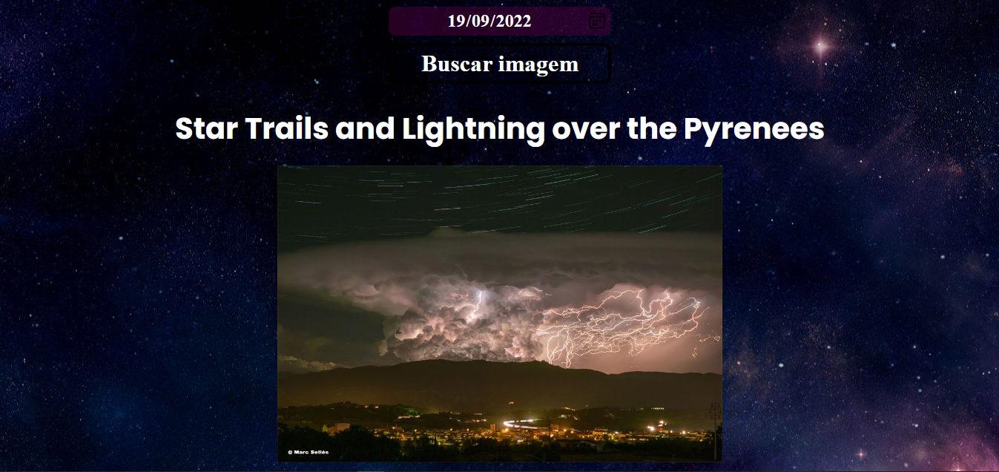

# NASA image of the day!

Projeto desenvolvido para estudo e utilização de APIs.

## 🎯 Objetivos do projeto
Criar uma aplicação onde consumo a API [APOD](https://api.nasa.gov/) da Nasa, pegando a data do dia e mostrando o conteúdo que pode ser tanto imagem quanto um vídeo.

### ✅ Checklist do projeto
 - [x] Fazer a conexão entre os serviços.
 - [x] Desenvolver o Estilo do Projeto.
 - [x] Sistema de alteração de datas.
 - [x] Exibição do conteúdo do dia.

## ✏️ Resultado final

[Resultado final](https://nasa-image-apod.vercel.app/)

## Licença

 **[MIT](https://mit-license.org/)**
